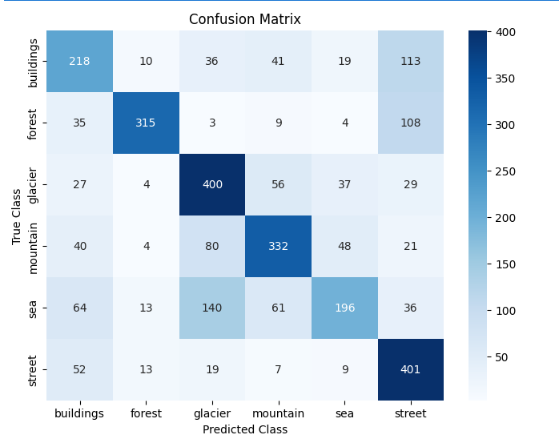
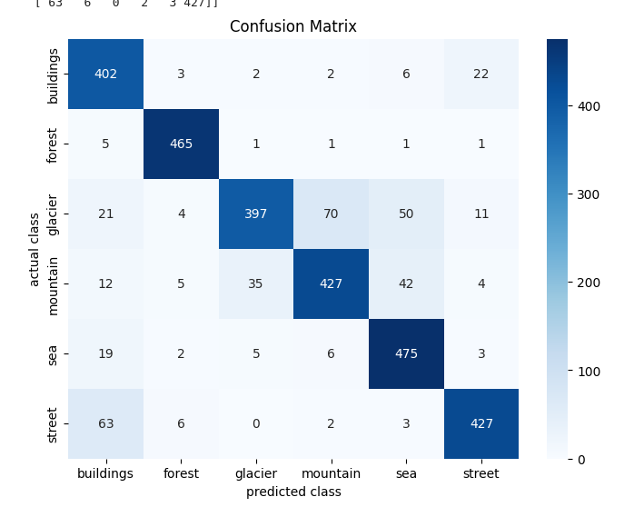
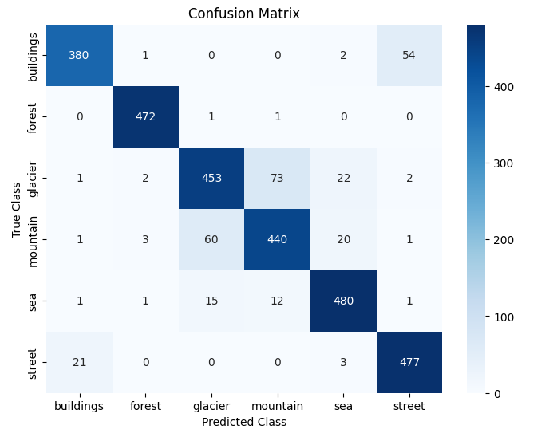

# Image Classification with Deep Learning

Welcome to the **Image Classification Project** repository! This project explores image classification using three different deep learning approaches:

1. **Artificial Neural Network (ANN)**
2. **Custom Convolutional Neural Network (CNN)**
3. **Transfer Learning with VGG-19**

Each approach is implemented in its own Jupyter Notebook, allowing you to compare their performance and understand the progression from simple models to more advanced architectures.


## Device Agnosticism & Training Environment

This code is device-agnostic; it automatically detects and uses a GPU if available, otherwise it defaults to CPU. **All models in this project were trained on an RTX A2000 GPU using CUDA in PyTorch.**

## Overview

In this project, we built and evaluated three models to classify natural scene images into six categories: *buildings*, *forest*, *glacier*, *mountain*, *sea*, and *street*. The models are:

- **ANN:** A fully connected network that flattens image data into a one-dimensional vector. This model serves as a baseline.
- **Custom CNN:** A handcrafted convolutional neural network that leverages spatial hierarchies in image data for improved performance.
- **VGG-19 (Transfer Learning):** A state-of-the-art pre-trained VGG-19 model, fine-tuned to our specific classification task using transfer learning techniques.

## Project Structure
├── README.md
├── Intel_image_classification dataset # Available on kaggle/roboflow
├── ann_notebook.ipynb            # Notebook with the ANN implementation
├── custom_cnn_notebook.ipynb     # Notebook with the custom CNN implementation
└── vgg19_transfer_notebook.ipynb # Notebook with the VGG-19 transfer learning implementation

- **`ann_notebook.ipynb`:** Contains code for a baseline fully connected network (ANN) applied to the image classification task.
- **`custom_cnn_notebook.ipynb`:** Contains the development and evaluation of a custom CNN, demonstrating improvements over the ANN.
- **`vgg19_transfer_notebook.ipynb`:** Implements transfer learning using VGG-19, showcasing state-of-the-art performance by leveraging pre-trained features.

## Data

The dataset used in this project consists of natural scene images organized into folders corresponding to the following classes:
- Buildings
- Forest
- Glacier
- Mountain
- Sea
- Street

Images are preprocessed (resized, normalized) using OpenCV and torchvision transforms to ensure consistency across models.

## Methodology

1. **Data Preprocessing:**  
   - Images are resized to appropriate dimensions (e.g., 128x128 for custom models, 224x224 for VGG-19).
   - Normalization is applied to scale pixel values to [0,1] and, for VGG-19, further normalized using ImageNet statistics.

2. **Model Training:**  
   - **ANN:** Uses a simple fully connected network after flattening the images.
   - **Custom CNN:** Exploits convolutional layers, batch normalization, dropout, and non-linear activations to better capture spatial features.
   - **VGG-19 Transfer Learning:** Utilizes a pre-trained VGG-19 model with frozen convolutional layers and a custom ANN classifier for our 6-class problem.

3. **Evaluation:**  
   - Models are evaluated using metrics such as classification accuracy, precision, recall, and F1-score.
   - Confusion matrices and classification reports are generated to analyze performance across all classes.
   - Cross-validation techniques (including k-fold CV) were also explored to ensure robustness of the model evaluation.

## Confusion Matrices

Below are the screenshots of the confusion matrices for each of the three models:

- **ANN Model:**
  

- **Custom CNN Model:**
  

- **VGG-19 Transfer Learning Model:**
  

## K-Fold Cross-Validation

For a robust evaluation, we also implemented k-fold cross-validation (with k=10) on the training set. In this approach:
- The dataset is split into 10 folds.
- For each fold, 1/10 of the data is used as the validation set while the remaining 9/10 is used for training.
- This process is repeated for 10 iterations (or more epochs while rotating the validation fold), and performance metrics are averaged to estimate model generalization.

## How to Run

1. **Clone this repository:**
   ```bash
   git clone https://github.com/your_username/Image-Classification-Deep-Learning.git
   cd Image-Classification-Deep-Learning

About Me

Hi, I’m Maitreya Mishra, a passionate Machine Learning intern at an ML research lab  with a keen interest in Deep Learning and Computer Vision and Applied/Agentic AI. This project is a part of my journey to explore and compare different architectures for image classification. I enjoy experimenting with various models—from simple ANNs to advanced CNNs and transfer learning—and analyzing their performance on challenging datasets.

If you have any questions or suggestions, feel free to reach out or open an issue. I’d love to hear your feedback!
